# Lawgic 羅輯 (邏輯遊戲 Logic Games)

---

## 📖 關於本專案 / About This Project

> **這是一個為了給兒子伴隨成長而親手打造的遊戲專案。**  
> 誠邀所有同好一同體驗、參與與交流，願我們都能重拾思維頓悟的純粹樂趣！  
> *A personal project handcrafted to accompany my son as he grows up.*  
> *Warmly inviting all puzzle enthusiasts to play, explore, and share the pure joy of logical insight!*

---

## 繁體中文介紹

### 平台簡介

**Lawgic 羅輯** 是一款依據世界謎題聯合會（WPF）、世界數獨錦標賽（WSC）與國際智力運動規章打造的現代化純邏輯競賽平台。平台徹底摒棄偽難度猜題與盲目窮舉，將 **高效能 Rust/WebAssembly 零拷貝核心**、**離線 SMT/SAT 生成守護進程（Generator Daemon）**、**前 0.1% 錦標賽級確定性生成引擎（Deterministic Procedural Engines）**、**離散圖論約束求解唯一解驗證**、**CHC 心理測量學模型** 與純粹無干擾的賽場級快捷操作融合，提供具備可驗證因果鏈條的職業級大腦心流競技環境。

### 伴讀與階梯式思維成長 (Pedagogical Philosophy)

* **直覺引導而非死記硬背**：全平台題型均配置嚴密平滑的階梯式難度（Kids ➔ Intermediate ➔ Expert ➔ Master ➔ Legendary ➔ Ultimate）。低階題目專注於啟發兒童對空間對稱、連通閉合、奇偶校驗與因果鏈條的純粹直覺；高階題庫無縫對軌世界解謎錦標賽（WPC）決賽圈水準。
* **零視覺干擾與沉浸心流**：為守護最純淨的思維專注力，全站嚴格剔除商業廣告、抽卡獎勵、代幣商城與暗黑引導機制，回歸黑體與幾何秩序本身的純粹之美。

### 架構特色

* **WASM 零拷貝記憶體與查表常數加速**：核心數獨與密集型運算模組全面以 Rust 編寫並編譯為 WebAssembly，具備編譯期預算靜態鄰居查表（LUT）與共享記憶體視圖（Zero-Copy Memory View），實現超低功耗與次毫秒級狀態收斂。
* **數學級唯一解證書（Exact Cover Uniqueness Engine）**：拒絕「算力不夠即判定唯一」的偽科學。全面實裝 AC-3 弧相容傳播、在軌動態 MRV 啟發式剪枝、12000 節點回溯防護與二分匹配，數學證明解空間基數精確為 1，杜絕多解殘局與超時作弊。
* **純邏輯閉環與因果推導率（100% Pure Deduction Rate & Breakpoint Ratio）**：高難度題目（Master / Legendary / Ultimate）嚴格執行人類邏輯求解鏈模擬，實裝真實邏輯斷點深度比（Breakpoint Ratio $\ge 80\%$），消滅早盤盲猜分支，確保試誤僅沈澱於尾盤收割。
* **真實認知轉折點（$\Delta\text{Domain}$ Entropy Crux & Eureka Moments）**：告別機械式技巧標籤。以每一步手筋造成的「加權候選域熵減量（$\Delta\text{Domain}$）」與「DAG 拓撲影響半徑」精確錨定破局天王山（Crux），動態捕捉交響樂般的頓悟波峰（Eureka Peaks）。
* **WPC 賽場級鍵位與心流防護（Speed-Solving Ergonomics）**：
  * **摩天透視 (`skyscraper`)**：
    * **無模態時間動態輸入 (Modeless Temporal Keypress)**：敲擊（<200ms）確信落子、長按（≥200ms）自然切換草稿候選數（Pencil Marks），徹底終結傳統數獨/天際線工具中「頻繁切換鉛筆開關」的工作記憶磨損。
    * **Vim 級全主鍵位盲打 (Home-Row Ergonomics)**：全面支援 `H/J/K/L` 與 `W/A/S/D` 游標磁吸平移，搭配 QWERTY 鍵位直映數字（`Q~O` / `A~L`），實現雙手完全不離主鍵區的競速操控。
    * **預測性虛擬沙盤 (Pre-flight Ray Sandbox)**：按鍵落子前微秒級射線投射，即時計算該高度對四向視線的幾何影響；若將觸發不可逆違規，外圍線索即時觸發柔和預警，提供前瞻性心智沙盤。
    * **漸進揭露式元認知階梯 (Metacognitive Ladder)**：三級引導體系（Level 1 宏觀戰略聚焦 ➔ Level 2 戰術原理解析 ➔ Level 3 微觀落子執行），拒絕機械式劇透，引導選手自主頓悟。
    * **可解釋性幾何衝突診斷 (Occlusion Diagnostic)**：即時捕捉前綴超標與容量擠壓失效，點擊紅化線索即刻彈出數學級診斷說明（如「未填滿前可見樓層已超標」）。
    * **三幕式實時節奏標尺 (Pacing Metronome)**：依據難度 Logit 動態切分開局（20%）、中局轉折（55%）與終局連鎖（25%）時間槽，實時顯示領先/滯後秒數（Delta Bar），精確調控解題節奏。
  * **四角分割 (`shikaku`)**：
    * **八分節段頂點奇偶光流 (Octant Segmented Vertex Parity)**：邊界光流嚴格以矩形 4 個幾何角點（Vertices）落在邊界節段上的接觸次數為基準，消除覆蓋長度造成的拓撲相位差，餘光瞬態定位缺陷象限。
    * **四維因果張量質量場 (Causal Tensor Field)**：預覽框輝度直接反映其對未解質數與邊界線索走向的空間拘束密度，徹底擺脫單純貼邊長度的平面誤導。
    * **雙擊退火蒸發 (Double-Tap Annealing)**：單擊戰術冷審視高亮、280ms 雙擊觸發 150ms 幾何向心退火縮小消失並伴隨 45ms 頓挫震動，徹底杜絕指尖靜電誤觸導致的心流崩塌。
    * **奇異點引力坍縮與無字觸覺遙測 (Singularity Collapse & Haptic Wave)**：結算瞬間矩形向最後落子質心向心爆炸塌陷為點；全盤徹底無字化，賽後秒數與步數透過 Web Vibration API 原生編碼為**長短脈衝引力波**（長震為十位、短震為個位），觸碰事件視界即可隨時觸覺重讀。
  * **迴路封閉 (`slitherlink`)**：
    * **7 步認知極限波束反證 (Human-Bounded Beam-3 BFS)**：拋棄電腦無上限暴力窮舉，將前向試錯深度嚴格錨定在人類短期工作記憶極限（$\le 7$ 步），配合寬度為 3 的波束搜尋（Beam-3 BFS）同時驗證度數溢出、線索餓死與 DSU 拓撲死環，杜絕非人道計算題。
    * **四維認知範疇與破局轉折點 (Cognitive Inflection Tracking)**：演繹步進全面語意範疇化（候選域收斂 ➔ 幾何定式 ➔ 拓撲死環防禦 ➔ 反證假說），精確標記思維維度躍遷的「邏輯高潮點」，配合四象限空間 Shannon 熵（$\ge 0.85$）確保題目兼具時間韻律與空間呼吸感。
    * **雙態幾何衝突透視 (Overflow vs. Starvation Radar)**：超越傳統單一線條超標報警，即時運算「邊界殘餘容量閉包（$4 - \text{Crosses} < \text{Clue}$）」，以琥珀色高亮提前警示「局部線索餓死死鎖」，將無效推理扼殺於萌芽。
    * **Zen 專注心流與寧靜閉合 (Zen Mode & Pure Finish)**：支援全主鍵盲打操控（`[F]` 專注模式、`[H]` 定式因果、`[N]` 無猜測開關、`[Ctrl+Z/Y]` 撤銷重做），通關瞬間以非侵入式微型光環橫幅取代喧鬧彈窗；支援 `Shift + 點擊` 戰術強制覆寫與 `🧪 [Trial]` 試錯純度獨立標記，兼顧新手護欄與大師實驗自由。
    * **多語言定式因果字典 (Multilingual Technique Registry)**：徹底廢棄機械代碼，即時以母語（中/英/日/德）展示「對角雙 2 排斥」、「1-3 相鄰互斥」、「斜對角 3-0 鎖定」等世界錦標賽定式名稱與因果解析鏈。
    * **跨分頁無感秒級恢復 (Session Resilience)**：底層綁定 `sessionStorage` 狀態快照，長達數十分鐘的 Ultimate 終極棋譜即時自動固化，誤觸重整無縫續盤。
  * **暗夜數牆 (`nurikabe`)**：左鍵黑海 / 右鍵白點 / Shift 鍵直達三態分治、零顏色語義干擾之純邊框警告 HUD、全域必然性白名單校驗與雙割點假設態自動切換、無級歷史時間軸滑塊（Timeline Scrubber）與歷史違規幀快速跳轉、AI 覆盤殘局斷點無縫接管（Take Over）、雙軌時鐘（物理掛鐘 vs. 純粹運算時間）輸出客觀思考密度（Density of Thought）。
  * **黑白雙星 (`kropki`)**：標準數獨宮格拓撲、貫穿式負約束微結構細虛線（No-Dot Barrier）、同數戰場十字光環高亮、8ms 觸覺行程微震動反饋、可逆 Auto-Notes 快照避險、20% 分段配速條（Splits Telemetry）。
  * **數和密碼 (`kakuro`)**：跑道局部性解空間、180° 對稱區塊侵蝕黑牆、所見即所填候選條、極限和差集合閉包、真·正交容量閉區間擠壓（Capacity Squeeze）、中盤模 9 數字根同餘剪枝。
  * **黑白分明 (`heyawake`)**：方向鍵/WASD 游標磁吸縮放高亮、二態極速切換（空白 ↔ 填黑）、靜默咽喉割點雷達。
  * **天平不等 (`futoshiki`)**：T9 固定三欄盲打九宮格、雙擊數字鎖定注入模式（Injection Mode）、永久十字瞄準線、一鍵硬切無延遲渦輪模式（Turbo Mode）。
  * **隻眼獨尊 (`hitori`)**：左鍵主決策循環、右鍵紙本鉛筆草稿三態標記（Pencil Marking）、衝突與同數空間波浪底線視覺疊加、即時 APM 戰績追蹤。
  * **燈泡照明 (`lightup`)**：左右鍵瞬發分流（左鍵 💡 / 右鍵 •）、行動端零延遲三態模式鎖定棒（Mode Stick）、50 步環形快照與審計軌跡深度綁定、反向暗區盲點凸顯（Blindspot Highlight）、雙因子空間熱區教練提示（Hot-Zone Hinting）、WPC 鉑金/金牌/銀牌不可逆後置操作審計。
  * **矢印連線 (`yajilin`)**：閉合迴路自避檢驗、箭頭射線黑格拓撲遮蔽、相鄰黑格互斥判定、角落單元閉鎖剪枝。
* **臨床級反作弊監控與專業監考（Proctoring & Anti-Cheat）**：整合 `useAntiCheatMonitor`、`clinicalProctoring` 與硬體級輸入防漂移偵測，確保錦標賽競技數據的客觀嚴密。
* **嚴格賽事裸裝模式（Strict Tournament Mode）**：開啟賽事模式即強制隱蔽所有即時衝突紅框、波浪輔助線與虛假標稱配額，鎖定盤面禁止提示，還原國際大賽現場的「無輔助裸裝對決」。
* **零信任防偽存證簽章（Zero-Trust Receipt）**：通關後透過 Web Crypto API 原生硬體加速生成 SHA-256 數位簽章與常數時間核驗，確保各項賽事通關憑證與個人最佳紀錄（PB）無法篡改。
* **全封閉離線 PWA 體驗**：整合具備 1.8 秒超時熔斷保護與 WebAssembly 二進制快取特化之 Service Worker，配合 iOS 動態島與底部 Safe Area 邊界適配，支援手機、平板與桌面端全螢幕離線流暢遊玩。

---

### 核心遊戲矩陣 (Core Game Matrix - 18 款正式遊戲)

| 代號 | 遊戲名稱 | 核心能力維度 (CHC) | 演算法與賽事級特點 |
| --- | --- | --- | --- |
| `skyscraper` | **摩天透視** | 3D 心理旋轉 (Gv)、圖論約束傳播 (Gf)、工作記憶 (Gwm) | 雙向視線帶剪枝 Line-CSP 排列求解器、推導依賴有向無環圖 (Derivation DAG)、破局天王山張力評估 (The Crux Metric)、Cowan 4-Chunk 記憶極限校準懲罰、格式塔模塊壓縮率 (0.35~0.45)、終局反機械化審美濾鏡、四邊線索視覺熵和諧度檢驗、無模態長按草稿標記、Vim 盲打、預測性沙盤微光、賽後破局點劇本覆盤 |
| `shikaku` | **四角分割** | 幾何整除、空間張量、頂點奇偶 | 互鎖咬合波前生長（Interlocking Growth）、破缺對稱（90/10 誘敵背刺）、邊界頂點奇偶閉合鎖定（Boundary Vertex Parity Lock）、因果張量質量場預覽、雙擊退火蒸發、奇異點向心引力坍縮、純觸覺震動脈衝電碼遙測（Zero-Text Haptic Telemetry） |
| `slitherlink` | **迴路封閉** | 拓撲閉環、空間幾何定式 (Gv)、歸謬推理 (Gf) | 螺旋漢密爾頓擾動自然環路、雙向對角雙 2 / 1-3 相鄰互斥定式、7 步認知極限 Beam-3 BFS 反證探針、四象限空間 Shannon 熵平衡、語意範疇轉折點、Zen 專注模式、超標/飢餓雙態衝突雷達、Shift 戰術試錯覆寫標記、WPC 冠軍思路模板生成 |
| `nurikabe` | **暗夜數牆** | 平面連通、圖論割點、拓撲張力 | 多源形態發生競賽生長（Morphogenesis）、動量轉向纏繞度調控、雙割點拓撲奇點過濾（Dual-Cut Singularity）、傳播優先回溯（CP-Solver）唯一解驗證、純邊框 HUD 透視、時間軸違規熱點書籤、思考密度（Density of Thought）計量 |
| `kropki` | **黑白雙星** | 數理偏序、宮格空間排他 | 正統數獨宮格拓撲（2x2/2x3/3x3）、全相鄰無點負約束（Full Kropki）、雙向 X-Wing 魚形排除、4x 超加權樞紐錨定、真實斷點深度比（$\ge 80\%$）、貫穿虛線屏障、8ms 觸覺行程鍵盤 |
| `kakuro` | **數和密碼** | 整數分割、數論同餘閉包 | 跑道局部性獨立去重、180° 對稱區塊侵蝕黑牆、雙向極限和差集合閉包、真·正交容量閉區間擠壓（Capacity Squeeze）、中盤模 9 數字根同餘剪枝、封閉疊代局部傳播、所見即所填候選條 |
| `maze` | **空間迷宮** | 空間導航、心智心圖 | 質數動態網格碎形、雙入口時間黑洞、視覺直線性後悔值、雙胞胎地標悖論、重疊率 $<40\%$ 逆向驗證、Boss 二階段精神污染 |
| `sudoku` | **數獨魔陣** | 約束傳播、工作記憶 | Rust/WASM 零拷貝引擎、MRV 位元剪枝、全向 Naked/Hidden Pairs、雙向 X-Wing 魚形定式、純定式 Lookahead-3 演繹反證探針 |
| `nonogram` | **像素數織** | 離散斷面掃描、衝動抑制 | 全向量化 Bitmask DP 單行交集、二維全域泛洪反證、DAG 依賴樹、Master Key 咽喉雪崩、400px 逐行光波斜向綻放、50 步 Undo 堆疊 |
| `dominoes` | **骨牌矩陣** | 二維鋪砌、全域配對覆蓋 | 數值感知二分匹配瓶頸割裂、MRV 前置剪枝無預算作弊、結構化棋譜反證鏈、行列雙重殘餘容量檢驗、邊角優先釘定與 32px 擴展抗干擾熱區 |
| `hashi` | **星際數橋** | 拓撲連通、生成樹度數 | 泊松圓盤四向張力均勻度、真 Tarjan 割邊雙橋暴力美學、前向最大容量擠壓（Max Capacity Fail）吃滿深度反證探針、連續純度光譜、42px 防漂移觸控外圈 |
| `heyawake` | **黑白分明** | 拓撲割點、視線射線阻斷 | BSP 互鎖咬合 L-Room 齒輪切割、主動射線閉包傳播（Active Ray Blocker）、真雙分支分歧熵、二態極速切換、咽喉割點雷達、鍵盤磁吸鎖定 |
| `futoshiki` | **天平不等** | 有向無環圖 (DAG)、傳遞閉包 | Knuth 無偏真隨機拉丁方、全量 Naked Pair 雙格數對引擎、Floyd-Warshall 矩陣全域複用、中局平行分支度（$\ge 2.4$）、雙擊鎖定注入模式、殘局調度加速 |
| `hitori` | **隻眼獨尊** | 負向排除、候選域熵減 | 視覺優先手筋層（三連全推導/三明治）、計數白黑雙向閉環、防碰撞批量塗黑、$\Delta\text{Domain}$ 加權熵減 Crux、紙本鉛筆草稿系統、50ms 極速熔斷 |
| `yajilin` | **矢印連線** | 正交迴路、射線指向計數 | 閉合迴路自避檢驗、箭頭射線黑格拓撲遮蔽、相鄰黑格互斥判定、角落單元閉鎖剪枝 |
| `tents` | **帳篷扎營** | 二分圖匹配、8-鄰域幾何 | 雙向抽屜原理閉鎖器、雙子樹角隅互斥破局器、Kuhn-Munkres 雙射唯一驗證 |
| `lightup` | **燈泡照明** | 視線投射、全域命題邏輯 | 偽布林（PB）基數不等式邊界收緊、全域 2-SAT Kosaraju SCC 蘊含圖傳播、雙向對稱歸謬探針（±Reductio）、動態美學拓撲（低階連通長城 / 高階孤島光阱）、頓悟峰值（Eureka Moments）心流計量、左鍵燈泡/右鍵防護點雙模極速落子、零延遲行動端模式鎖定棒（Mode Stick）、WPC 鉑金級無試錯實操審計 |
| `masyu` | **珍珠迴路** | 空間拓撲、正交折角約束 | 隨機自避蜿蜒迴路、貼邊黑白定式、相鄰黑珍珠排斥、CSP 唯一解 |

---

## 心理測量學與認知維度 / Psychometrics & CHC Model

平台所有題型均錨定 **Cattell-Horn-Carroll (CHC) 認知能力模型**，即時計算動態認知負荷與難度量表：

```mermaid
flowchart TD
    Gf["🧠 Gf (流體推理 / Fluid Intelligence)"]

    Gf --> Gv["🧭 Gv (空間視覺 / Visual-Spatial)"]
    Gf --> Nq["🔢 Nq (數量推理 / Quantitative)"]
    Gf --> Gwm["⚡ Gwm (工作記憶 / Working Memory)"]

    Gv --> M1["Maze (心智導航 / 拓撲避障)"]
    Gv --> M2["Slitherlink / Masyu (拓撲封閉迴路 / 對角雙2幾何排斥 / 空間Shannon熵)"]
    Gv --> M3["Nurikabe (雙割點拓撲奇點 / 多源形態發生 / 平面連通)"]
    Gv --> M4["Light Up (雙向射線 / 2-SAT 全域覆蓋)"]
    Gv --> M5["Skyscraper (3D 視線遮擋 / 空間透視推演)"]
    Gv --> M6["Nonogram (斷面掃描 / DAG關鍵深度)"]
    Gv --> M7["Hashi (泊松張力 / Tarjan割邊)"]
    Gv --> M8["Heyawake (L-Room咬合 / 射線閉包)"]
    Gv --> M9["Yajilin (方向線索 / 迴路避障)"]
    Gv --> M10["Shikaku (互鎖拓撲 / 邊界頂點奇偶 / 因果張量質量)"]

    Nq --> N1["Sudoku (交叉排他 / 魚定式)"]
    Nq --> N2["Kakuro (跑道局部性 / 數論模9同餘)"]
    Nq --> N3["Futoshiki (無偏拉丁方 / 數對鎖定)"]
    Nq --> N4["Dominoes (二分匹配 / 鋪砌全集)"]
    Nq --> N5["Hitori (視覺手筋優先 / 雙向計數強制)"]
    Nq --> N6["Kropki (宮格拓撲 / 全負約束 / 雙向魚)"]

    Gwm --> W1["候選數動態保留與鉛筆筆記 (Pencil Marks)"]
    Gwm --> W2["結構化前瞻反證樹沙盒"]
    Gwm --> W3["錯誤類型學與即時 APM 時序監測"]
    Gwm --> W4["無級時間軸滑塊與歷史分支回溯 (Timeline Scrubber)"]
    Gwm --> W5["雙軌思考密度計量 (Density of Thought)"]
    Gwm --> W6["Shikaku 觸覺震動引力波解碼 (Haptic Telemetry Recall)"]
    Gwm --> W7["Skyscraper (Cowan 4-Chunk 依賴鏈 / 格式塔模塊壓縮 / 實時節奏標尺)"]
    Gwm --> W8["Slitherlink (7步人類認知極限波束反證 / 雙態飢餓死鎖預警 / 轉折點追蹤)"]

```



---

## 技術架構與極限優化 / Technical Architecture

```text
┌─────────────────────────────────────────────────────────────┐
│                       Lawgic Presentation Layer             │
│   (React 18 + TailwindCSS + iOS Safe Area + PWA Hardened SW)│
└──────────────┬───────────────────────────────┬──────────────┘
               │                               │
               ▼ (Zero-Copy Pointer)           ▼ (Causal Step Stream)
┌──────────────────────────────┐ ┌────────────────────────────┐
│      WASM Core (Rust)        │ │  Procedural TS Engines     │
│  • Compile-time PEERS LUT    │ │ • Full Kropki Box Topology │
│  • Bitmask MRV Propagation   │ │ • Run-Local Modulo-9 Sieve │
│  • O(1) Backtrack Snapshot   │ │ • Dual-Cut Singularity Nur │
│                              │ │ • Vertex Parity Shikaku    │
│                              │ │ • Fast Line-CSP Skyscraper │
│                              │ │ • 2-SAT Kosaraju SCC Blk   │
│                              │ │ • Beam-3 BFS Slitherlink   │
└──────────────┬───────────────┘ └─────────────┬──────────────┘
               │                               │
               └───────────────┬───────────────┘
                               │
                               ▼
┌─────────────────────────────────────────────────────────────┐
│                    Clinical Integrity Layer                 │
│  Anti-Cheat Monitor + SMT Welder + Web Crypto SHA-256 Auth  │
└─────────────────────────────────────────────────────────────┘

```

---

## English Introduction

### Overview

**Lawgic** is a professional-grade competitive logic puzzle platform engineered to the standards of the World Puzzle Federation (WPF), World Sudoku Championship (WSC), and international mental athletics associations. Rejecting brute-force guessing and memory drills, the platform fuses **high-performance WebAssembly kernels**, deterministic procedural generation, SMT-welded puzzle daemons, CSP uniqueness validation, CHC cognitive models, and precision interaction for an ad-free, pure intellectual experience.

### Architecture Highlights

* **Zero-Copy WASM Core**: Computationally intensive solvers are written in Rust and compiled to WebAssembly, featuring compile-time static lookup tables (PEERS_TABLE) and zero-copy shared array memory mapping.
* **Exact Cover Uniqueness Engine**: Mathematical certainty replacing heuristic timeouts. Across Sudoku, Nonogram, Dominoes, Hashi, Heyawake, Futoshiki, Hitori, Kakuro, Kropki, Light Up, Nurikabe, Yajilin, Shikaku, Slitherlink, and Skyscraper, exact MRV backtracking solvers, Line-CSP engines, and value-constrained bipartite matching proofs guarantee puzzle solution cardinality equals exactly 1.
* **100% Pure Deduction Rate & Breakpoint Ratio**: Master, Legendary, and Ultimate tiers strictly enforce complete human deductive chain simulations with Breakpoint Depth Ratio $\ge 80\%$, discarding puzzles requiring trial-and-error branching during early and mid games.
* **True Cognitive Crux via $\Delta\text{Domain}$ Reduction**: Crux points are quantified using weighted candidate domain entropy reductions and DAG topological radii rather than arbitrary heuristic weights.
* **Speed-Solving Ergonomics**:
* **Skyscraper**:
* **Modeless Temporal Input**: Tap (<200ms) for firm placement; hold (≥200ms) for candidate pencil marks, eliminating modal toggling friction.
* **Vim-Style Home-Row Ergonomics**: Zero-travel `HJKL` / `WASD` cursor navigation paired with direct QWERTY number mapping (`Q-O` / `A-L`) for pure touch-typing speed.
* **Pre-flight Ray Projection**: Real-time orthogonal sightline simulation predicting feasibility before commitment, casting subtle warning halos on prospective violations.
* **Metacognitive Hint Hierarchy**: Progressive 3-tier coaching disclosure (Macro Strategy ➔ Tactical Mechanism ➔ Actionable Placement) preserving organic Eureka discovery.
* **Explainable Occlusion Diagnostics**: Real-time detection of prefix saturation and capacity squeeze failures, clicking red clues immediately displays mathematical diagnostics.
* **Real-time Pacing Metronome**: Live delta bar benchmarking time against 3-act cognitive allocations (Opening 20%, Midgame Crux 55%, Endgame Cascade 25%).


* **Shikaku**:
* **Octant Segmented Vertex Parity**: Edge halo strictly tracks corner touches (Vertices) across perimeter segments rather than raw overlap lengths, eradicating phase errors and enabling peripheral defect localization.
* **4D Causal Tensor Field**: Real-time mass luminance projecting constraints onto prime and corner degrees of freedom, discarding superficial edge-length brightness.
* **Double-Tap Annealing**: Single-tap cold tactical inspection; 280ms double-tap triggers a 150ms geometric implosion disappearance accompanied by a 45ms tactile notch, preventing misclick-induced cognitive blackout.
* **Singularity Collapse & Haptic Waves**: Centroid-directed implosion upon completion; full textless canvas with elapsed time and moves encoded into Web Vibration pulses (long pulse for tens, short for units).


* **Slitherlink**:
* **Human-Bounded Beam-3 Lookahead**: Strictly caps proof-by-contradiction depth to 7 steps (aligning with human working memory limits) with a Beam-3 BFS engine checking degree overflow, clue starvation, and topological subloops simultaneously.
* **4-Tier Cognitive Domain & Inflection Point Telemetry**: Deductive steps categorized semantically (Candidate ➔ Geometric ➔ Topological ➔ Hypothetical), dynamically identifying Crux phase shifts with 4-quadrant spatial Shannon entropy ($\ge 0.85$).
* **Dual-State Geometry Conflict Radar**: Instantaneously evaluates both line overflow and clue starvation ($4 - \text{Crosses} < \text{Clue}$), visually warning players of premature edge exhaustion with an amber warning halo.
* **Zen Focus Mode & Quiet Resolution**: Full home-row keybindings (`F` for Zen toggle, `H` for hint, `N` for no-guess, `Ctrl+Z/Y` for undo/redo), replacing celebratory modal popups with an elegant completion banner; supports `Shift+Click` tactical bypass with explicit `[Trial]` purity ledger tagging.
* **Multilingual Technique Registry & Session Resilience**: Full i18n deduction labels (EN/ZH/JA/DE) replacing raw snake_case keys, backed by seamless `sessionStorage` crash-proof state restoration.


* **Nurikabe**: Left/right-click zero-latency dual dispatch, non-intrusive border-only HUD eliminating semantic color interference, strict deterministic whitelist with automatic Topological Hypothesis fallback, continuous timeline scrubber with violation bookmarks, seamless AI replay breakpoint take-over, and dual-clock Density of Thought telemetry.
* **Kropki**: Standard box topology, linear dashed negative-constraint barriers, localized crosshair highlight, 8ms mechanical haptic feedback, reversible auto-notes infill, 20% pace splits.
* **Kakuro**: Run-local solution spaces, blocky 180° erosion layout, clickable candidate strip, extreme sum set-closures, cross-capacity squeeze, deep modulo-9 digital root congruence filters.
* **Heyawake**: WASD/Arrow magnetic cursor scaling, dual-state speed toggle (Blank ↔ Black), silent cut-point radar.
* **Futoshiki**: Fixed 3-column numpad, double-click number injection mode, permanent crosshair guide, zero-latency Turbo Mode.
* **Hitori**: Primary click cycle, secondary pencil-marking (Pencil Marks), real-time action & APM metric tracker.
* **Light Up**: Dual-mode left/right instantaneous dispatch (Left: Light, Right: Dot), zero-latency Mobile Mode Stick, 50-step circular snapshot stack, inverted darkness focus, dual-factor hot-zone hinting, immutable Grandmaster Platinum post-audit.
* **Yajilin**: Closed self-avoiding loop detection, ray-casting black cell masking, adjacent cell exclusivity.


* **Clinical Proctoring & Integrity Monitoring**: Integrates `useAntiCheatMonitor`, `clinicalProctoring`, and hardware input drift heuristics to ensure objective competitive fidelity.
* **Strict Tournament Mode**: Completely suppresses in-game conflict glows, wave overlays, and nominal quota labels for unassisted, competition-compliant solving.
* **Zero-Trust Verification**: Hard locks board generation and hints during official attempts; generates cryptographic SHA-256 receipts via Web Crypto API with constant-time equality checks.

---

## 本地開發 / Local Development

### 環境需求 / Prerequisites

* **Node.js**: >= 20.0.0
* **npm**: >= 10.0.0
* **Rust**: >= 1.75.0 (含 `wasm32-unknown-unknown` 目標，若需修改 WASM 核心)
* **wasm-pack**: >= 0.12.0
* **Python**: >= 3.10 (若需使用 `generator_daemon/` 批量生產種子庫)

### 安裝與啟動 / Setup & Run

```bash
# 1. 進入前端目錄 / Navigate to frontend
cd web-frontend

# 2. 確定性安裝相依套件 / Install dependencies
npm ci

# 3. 啟動本機開發伺服器 / Start dev server
npm run dev

# 4. 進行嚴格型別檢查與生產打包 / Production build & type-check
npm run build

```

### 構建 WebAssembly 核心 (可選) / Build WASM Core (Optional)

```bash
# 進入 Rust 核心引擎目錄 / Navigate to core engine
cd core-engine

# 編譯並優化 WASM 產物至前端目錄 / Build & optimize WASM
wasm-pack build --target web --release --out-dir ../web-frontend/src/wasm
rm -f ../web-frontend/src/wasm/.gitignore

```

### 專案目錄結構 / Directory Layout

```text
Lawgic/
├── .github/workflows/        # 具備雙層快取之 GitHub Pages 自動化 CI/CD (deploy.yml)
├── core-engine/              # Rust 高性能計算與 WASM 模組 (Sudoku/WASM Kernel)
│   ├── Cargo.toml
│   └── src/lib.rs
├── generator_daemon/         # 離線題目工廠與 SMT 求解器守護進程 (Python)
│   ├── batch_factory.py
│   ├── maze_generator.py
│   └── smt_welder.py
├── web-frontend/
│   ├── public/               # PWA manifest、安全 Service Worker (sw.js) 與靜態圖示
│   ├── src/
│   │   ├── components/       # 18 款競速駕駛艙 (含 SkyscraperBoard、SlitherlinkBoard)
│   │   ├── contexts/         # 語系切換 (LanguageContext) 與無障礙支援 (AccessibilityContext)
│   │   ├── engines/          # 18 款競技級演算法 (含 Slitherlink Beam-3 BFS 與 DAG 拓撲分析)
│   │   ├── generated/        # 靜態種子庫與題目元數據預編譯快取 (JSON)
│   │   ├── hooks/            # useLearnerProfile、useSkyscraperGame、useAntiCheatMonitor
│   │   ├── registry/         # RendererRegistry (動態分發與容錯重試註冊中心)
│   │   ├── utils/            # 臨床監考、動態常模、密碼學簽章、金庫存儲與排行榜
│   │   ├── App.tsx           # 主儀表板、非同步時間切片生成與賽事模式路由
│   │   └── main.tsx          # 應用程式入口
│   ├── package.json
│   ├── tsconfig.json
│   └── vite.config.ts
├── GOVERNANCE_AND_COMPLIANCE.md # 合規性審計與資料治理政策聲明
├── LICENSE                   # MIT 授權條款
└── README.md                 # 專案說明文件

```

---

## 授權條款 / License

本專案採用 [MIT License](https://www.google.com/search?q=LICENSE) 授權開放開源社群交流使用。

