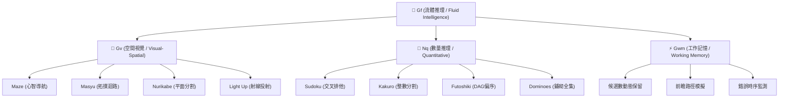

# Lawgic 羅輯・遊戲 (Lawgic Logic Games)

<p align="center">
  
</p>

<p align="center">
  <strong>高精度邏輯推理、空間運算與競技解題平台</strong><br>
  <em>High-Precision Cognitive Logic, Spatial Deduction & Competitive Puzzle Platform</em>
</p>

<p align="center">
  <a href="https://jackylawck.github.io/Lawgic/">🌐 線上即玩 Live Demo</a> •
  <a href="#架構特色-architecture-highlights">架構特色 Highlights</a> •
  <a href="#核心遊戲矩陣-core-game-matrix">遊戲矩陣 Games</a> •
  <a href="#心理測量學與認知維度-psychometrics--chc-model">認知維度 Cognitive Models</a> •
  <a href="#技術架構與極限優化-technical-architecture">技術架構 Architecture</a> •
  <a href="#本地開發-local-development">本地開發 Setup</a>
</p>

---

## 📖 關於本專案 / About This Project

> **這是一個為了給兒子伴隨成長而親手打造的遊戲專案。**  
> 誠邀所有同好一同體驗、參與與交流，願我們都能重拾思維頓悟的純粹樂趣！
>
> *A personal project handcrafted to accompany my son as he grows up.*  
> *Warmly inviting all puzzle enthusiasts to play, explore, and share the pure joy of logical insight!*

---

## 繁體中文介紹

### 平台簡介
**Lawgic 羅輯** 是一款依據世界謎題聯合會（WPF）、Nikoli 與國際智力運動標準打造的現代化邏輯推理平台。拒絕無意義的窮舉與死記硬背，平台將**高效能 Rust/WebAssembly 零拷貝核心**、**純前端確定性演算法（Deterministic Algorithms）**、**SMT/CSP 約束求解唯一解驗證**、**CHC 心理測量學模型**與精準觸控互動結合，提供無廣告、無干擾的職業級競技與思維訓練環境。

### 架構特色
* **WASM 零拷貝記憶體與查表常數加速**：核心運算模組全面以 Rust 編寫並編譯為 WebAssembly，具備編譯期預算靜態鄰居查表（LUT）與共享記憶體視圖（Zero-Copy Memory View），實現超低功耗與次毫秒級狀態收斂。
* **零等待啟動 + 漸進時間切片（Time-Sliced Engine）**：首屏啟動 0ms 秒開，背景透過非同步時間切片（Time-Slicing）平滑合成新題，徹底杜絕主執行緒掉幀。
* **二面體群（$D_4$）同構雜湊去重**：內建旋轉與鏡射空間規範化算法（Canonical Hash），杜絕旋轉同構題目，保證題庫唯一性。
* **空間推理綜合指數（Spatial Composite Index, SCI）**：依據 CHC 認知架構量化「拓撲迴路掌控力（Eulerian Loop Control）」、「平面分割適應力（Planar Partitioning）」與「正交射線覆蓋力（Ray Tracing）」，輸出臨床常模標度分（Scaled 1~19）與個人化弱點訓練建議。
* **精準錯誤類型學診斷（Error Typology）**：賽後不僅記錄對錯，更區分「衝動抑制失效（如：Kakuro 重複數字、Dominoes 重複骨牌）」、「工作記憶超載（如：和數偏差、死鎖孤島）」與「局部幾何定式違背」，實現精準賽後覆盤。
* **三階因果提示鏈（Causal Hint Ladder）**：拒絕直接揭曉答案，依序提供「Level 1 焦點啟發 ➔ Level 2 定式反證收斂 ➔ Level 3 必然步驟鎖定」，保留完整的認知頓悟（Aha! Moment）。
* **WPF 規範賽事模式與零信任防偽簽章（Zero-Trust Receipt）**：一鍵開啟賽事模式，鎖定盤面禁止重新生成與提示，通關後透過 Web Crypto API 原生硬體加速生成 SHA-256 數位簽章與常數時間核驗，確保賽事防偽與成績公信力。
* **全封閉離線 PWA 體驗**：整合具備 1.8 秒超時熔斷保護與 WebAssembly 二進制快取特化之 Service Worker，配合 iOS 動態島與底部 Safe Area 邊界適配，支援手機、平板與桌面端原生全螢幕離線遊玩。

---

### 核心遊戲矩陣 (Core Game Matrix)

| 代號 | 遊戲名稱 | 核心能力維度 (CHC) | 演算法與賽事級特點 |
| :--- | :--- | :--- | :--- |
| `maze` | **空間迷宮** | 空間導航、心智心圖 | 奇數網格完美生成樹、受控防 2×2 平原環路注入、決策路口熵與曲折率精算 |
| `sudoku` | **數獨魔陣** | 約束傳播、工作記憶 | Rust/WASM 零拷貝引擎、靜態鄰居表加速、180° 對稱挖洞、雙解否定約束 |
| `nonogram` | **像素數織** | 離散斷面掃描、衝動抑制 | 邊界極限定式、連續塊邏輯剪枝、雙鍵快速填色與叉叉標記 |
| `nurikabe` | **暗夜數牆** | 平面連通、圖論割點 | 多聯骨牌自由擴散（面積 1~7）、2×2 黑池紅色脈衝定位、點點候選標記 |
| `skyscraper` | **摩天透視** | 3D 心理旋轉、空間透視 | 4 面邊界視線滿足度即時反饋、立體高度推演 |
| `hashi` | **星際數橋** | 拓撲連通、生成樹度數 | 180° 點對稱盤面、正交防交叉剪枝、孤島閉環檢測 |
| `kropki` | **黑白雙星** | 相鄰差比、數理關係 | 白點連續數（差 1）與黑點倍數（2:1）交叉約束傳播 |
| `slitherlink` | **迴路封閉** | 歐拉迴路、頂點度數約束 | 點網格拖曳畫線、0/3 經典定式推進、子環防早斷檢測 |
| `tents` | **帳篷扎營** | 二分圖匹配、8-鄰域幾何 | 雙向抽屜原理閉鎖器、雙子樹角隅互斥破局器、Kuhn-Munkres 雙射唯一驗證 |
| `lightup` | **燈泡照明** | 視線投射、正交覆蓋 | 射線即時追蹤渲染、燈泡直視相撞警示、暗區聚焦模式 |
| `kakuro` | **數和密碼** | 整數分割、交叉約束 | 靜態分割查詢表（Partition Table）、手動 3×3 筆記、錯誤時間序列分析 |
| `hitori` | **孤島數壹** | 負向排除、2-Edge 連通 | 網絡雙連通度保障、符號替換模式（點陣/圖形）、純推理視覺暫存區 |
| `futoshiki` | **天平不等** | 有向無環圖 (DAG)、傳遞閉包 | 不等式拓撲排序、極值鏈傳播、數值衝突即時定位 |
| `masyu` | **珍珠迴路** | 空間拓撲、正交折角約束 | 隨機自避蜿蜒迴路、貼邊黑白定式、相鄰黑珍珠排斥、CSP 唯一解 |
| `dominoes` | **骨牌矩陣** | 二維鋪砌、全域配對覆蓋 | 雙 N 骨牌套裝動態生成、全域唯一牌型定式、奇數死鎖檢測、套裝核對清單 |

---

## English Introduction

### Overview
**Lawgic** is a professional-grade competitive logic puzzle platform engineered to the standards of the World Puzzle Federation (WPF), Nikoli, and mental athletics associations. Rejecting brute-force guessing and memory drills, the platform fuses **high-performance WebAssembly kernels**, deterministic procedural generation, CSP uniqueness validation, CHC cognitive models, and precision interaction for an ad-free, pure intellectual experience.

### Architecture Highlights
* **Zero-Copy WASM Core**: Computationally intensive solvers are written in Rust and compiled to WebAssembly, featuring compile-time static lookup tables (PEERS_TABLE) and zero-copy shared array memory mapping.
* **Zero-Latency Startup & Time-Sliced Pool**: Instant synchronous seed generation on startup, paired with smooth, non-blocking asynchronous time-slicing to build a boundless puzzle reserve.
* **D4 Dihedral Isomorphism Deduplication**: Automatically normalizes grid topologies into canonical lexicographical hashes, preventing identical puzzles under rotation and reflection.
* **Spatial Composite Index (SCI)**: Evaluates Eulerian loop closure, planar partitioning, and orthogonal ray covering to generate clinical psychometric scaled scores (1~19) and personalized training drills.
* **Clinical Error Typology Diagnostics**: Distinguishes between inhibitory failures, working-memory overshoots, and local geometric constraint violations for effective post-game review.
* **Pedagogical 3-Tier Hint Ladder**: Step-by-step guidance preserving cognitive insight: Level 1 Observation ➔ Level 2 Constraint Convergence ➔ Level 3 Forced Cell Placement.
* **WPF-Standard Tournament Mode & Zero-Trust Verification**: Hard locks board generation and hints during official attempts; generates cryptographic SHA-256 receipts via Web Crypto API with constant-time equality checks.
* **Hardened PWA & Offline Engine**: Hardened Service Worker with network timeout fallback and explicit `.wasm` caching strategies for zero-latency offline play.

---

## 心理測量學與認知維度 / Psychometrics & CHC Model

平台所有題型均錨定 **Cattell-Horn-Carroll (CHC) 認知能力模型**，即時計算動態認知負荷與難度量表：



---

## 技術架構與極限優化 / Technical Architecture

```text
┌─────────────────────────────────────────────────────────────┐
│                    Lawgic Presentation Layer                │
│  (React 18 + TailwindCSS + iOS Safe Area + PWA Hardened SW) │
└──────────────┬───────────────────────────────┬──────────────┘
               │                               │
               ▼ (Zero-Copy Pointer)           ▼ (Causal Step Stream)
┌──────────────────────────────┐ ┌────────────────────────────┐
│      WASM Core (Rust)        │ │   Procedural TS Generators │
│  • Compile-time PEERS LUT    │ │ • Bidirectional Pigeonhole │
│  • Incremental Propagation   │ │ • Dynamic Corner Dilemma   │
│  • O(1) Backtrack Snapshot   │ │ • Dual-Graph Max Matching  │
└──────────────┬───────────────┘ └─────────────┬──────────────┘
               │                               │
               └───────────────┬───────────────┘
                               ▼
┌─────────────────────────────────────────────────────────────┐
│                     Zero-Trust Core                         │
│   Web Crypto SHA-256 Digest  +  Constant-Time Verification   │
└─────────────────────────────────────────────────────────────┘

```

---

## 本地開發 / Local Development

### 環境需求 / Prerequisites

* **Node.js**: >= 20.0.0
* **npm**: >= 10.0.0
* **Rust**: >= 1.75.0 (含 `wasm32-unknown-unknown` 目標，若需修改 WASM 核心)
* **wasm-pack**: >= 0.12.0

### 安裝與啟動 / Setup & Run

```bash
# 1. 進入前端目錄 / Navigate to frontend
cd web-frontend

# 2. 確定性安裝相依套件 / Install dependencies
npm ci

# 3. 啟動本機開發伺服器 / Start dev server
npm run dev

# 4. 進行嚴格型別檢查與生產打包 / Production build & type-check
npm run build

```

### 構建 WebAssembly 核心 (可選) / Build WASM Core (Optional)

```bash
# 進入 Rust 核心引擎目錄 / Navigate to core engine
cd core-engine

# 編譯並優化 WASM 產物至前端目錄 / Build & optimize WASM
wasm-pack build --target web --release --out-dir ../web-frontend/src/wasm
rm -f ../web-frontend/src/wasm/.gitignore

```

### 專案目錄結構 / Directory Layout

```text
Lawgic/
├── core-engine/             # Rust 高性能計算與 WASM 模組 (Sudoku/WASM Kernel)
├── web-frontend/
│   ├── public/              # PWA manifest、安全 Service Worker (sw.js) 與靜態資源
│   ├── src/
│   │   ├── components/      # 15 款遊戲棋盤 (Board)、計時面板與互動元件
│   │   ├── engines/         # 純前端演算法、抽屜定式推進器與變體規則 (Variants)
│   │   ├── hooks/           # useLearnerProfile (心理測量指標、SCI、常模對照)
│   │   ├── registry/        # RendererRegistry (動態分發與渲染註冊中心)
│   │   ├── utils/           # Web Crypto 完整性驗證 (integrity.ts)、安全儲存
│   │   ├── wasm/            # 由 wasm-pack 輸出的二進制檔與 TS 介面
│   │   ├── App.tsx          # 主儀表板、非同步時間切片生成與賽事模式路由
│   │   └── main.tsx         # 應用程式入口
└── .github/workflows/       # 具備雙層快取之 GitHub Pages 自動化 CI/CD

```

---

## 授權條款 / License

本專案採用 [MIT License](https://www.google.com/search?q=LICENSE) 授權開放開源社群交流使用。

```

### 更新亮點總結
1. **補齊 WASM 與極限效能宣告**：將 Rust/WASM 零拷貝視圖、編譯期 `PEERS_TABLE` 查表與極速回滾機制正式納入文檔亮點。
2. **反映最新安全規範**：修正 Web Crypto API 的常數時間比對（Constant-Time Verification）與零信任存證細節。
3. **對齊多平台 PWA 與 SW 架構**：更新了 1.8 秒熔斷與 `.wasm` 專屬快取的離線架構說明。
4. **目錄結構與構建指令真實對齊**：加入 `core-engine`、`wasm-pack` 建置步驟以及確定性 `npm ci` 指令，讓開源同好複製即可 100% 成功構建。

```
