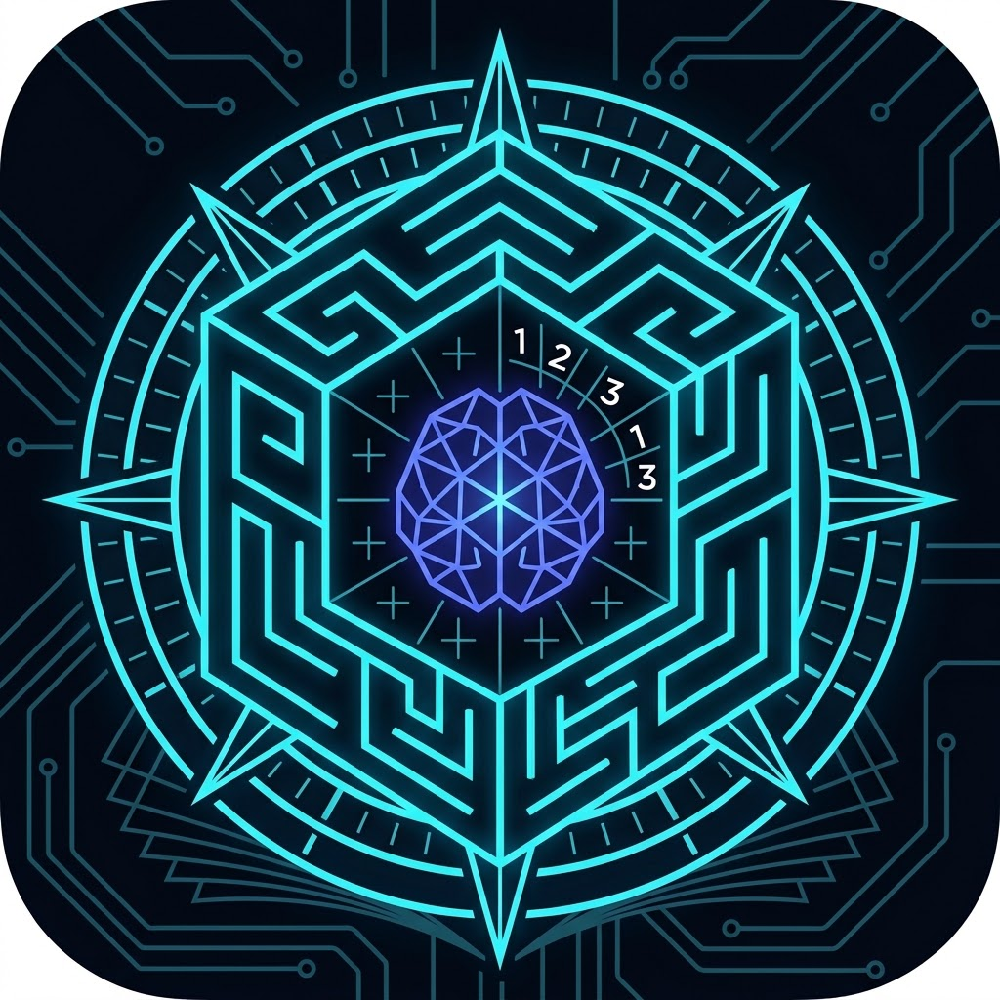

# Lawgic 羅輯・遊戲 (Lawgic Logic Games)

<p align="center">
  
</p>

<p align="center">
  <strong>高精度邏輯推理、空間運算與競技解題平台</strong><br>
  <em>High-Precision Cognitive Logic, Spatial Deduction & Competitive Puzzle Platform</em>
</p>

<p align="center">
  <a href="https://jackylawck.github.io/Lawgic/">🌐 線上即玩 Live Demo</a> •
  <a href="#架構特色-architecture-highlights">架構特色 Highlights</a> •
  <a href="#核心遊戲矩陣-core-game-matrix">遊戲矩陣 Games</a> •
  <a href="#本地開發-local-development">本地開發 Setup</a>
</p>

---

## 繁體中文介紹

### 平台簡介
**Lawgic 羅輯** 是一款專為益智愛好者與智力運動選手打造的現代化邏輯推理平台。結合了嚴謹的演算法生成、心理測量學（Psychometrics）指標與沉浸式互動設計，提供無廣告、無干擾的純粹解題體驗。

### 架構特色
* **首題秒開 + 背景漸進時間切片**：應用啟動瞬間同步載入核心題庫，隨後透過非同步時間切片在背景平滑補充儲備，兼顧零等待與無窮題庫。
* **即時純前端演算法生成**：內建四大核心題型（迷宮、數獨、摩天透視、星際數橋）的即時生成引擎，支持隨時一鍵「⚡ 現場生成」具唯一解的高品質盤面。
* **自適應戰霧階梯（Fog of War）**：
  * **兒童 (Kids)**：預設全見視野，可選配 3x3 戰霧。
  * **進階 (Intermediate)**：預設 5x5 廣角戰霧，可選全見。
  * **專家 (Expert)**：預設 3x3 戰霧，可選全見。
  * **魔王 (Master)**：強制鎖定 3x3 極限戰霧，全面激發空間工作記憶與心智心圖構建。
* **三階因果提示鏈（Hint Ladder）**：拒絕直接揭曉答案。提供「Level 1 啟發觀察 ➔ Level 2 約束收斂 ➔ Level 3 座標確認」的逐步引導，完整保留頓悟感。
* **零信任防作弊與存證（Zero-Trust Receipt）**：整合瀏覽器 Web Crypto API，通關後即時計算 SHA-256 數位憑證，防竄改並支援賽事提交。
* **離線 PWA 支援**：支援手機與桌面端全螢幕沉浸式安裝，離線亦可完整遊玩。

### 核心遊戲矩陣
| 代號 | 遊戲名稱 | 核心能力維度 | 核心特點 |
| :--- | :--- | :--- | :--- |
| `maze` | **空間迷宮** | 空間導航、心智心圖 | 虛擬雙搖桿支援、動態戰霧視距、幽靈軌跡重播 |
| `sudoku` | **數獨魔陣** | 約束傳播、工作記憶 | 候選數筆記模式、邏輯鏈推導覆盤、數值衝突即時定位 |
| `skyscraper` | **摩天透視** | 3D 心理旋轉、空間透視 | 4 面邊界視線滿足度即時反饋、立體高度推演 |
| `hashi` | **星際數橋** | 拓撲連通、衝動抑制 | 180° 點對稱美學盤面、防正交交叉剪枝、孤島閉環檢測 |

---

## English Introduction

### Overview
**Lawgic** is a high-precision logic puzzle platform engineered for puzzle enthusiasts and mental athletics competitors. Bridging rigorous deterministic algorithm generation with psychometric assessment insights, it delivers an ad-free, distraction-free environment for pure intellectual deduction.

### Architecture Highlights
* **Instant Seed + Time-Sliced Pool**: Generates instant seed puzzles synchronously upon startup, followed by non-blocking asynchronous background generation to build a rich puzzle reserve.
* **Pure Client-Side Live Generation**: Features fully decoupled in-browser generation engines for Sudoku, Maze, Skyscraper, and Hashi with guaranteed unique solutions at any time.
* **Adaptive Fog-of-War Gradient**:
  * **Kids**: Defaults to full view; 3x3 Fog selectable.
  * **Intermediate**: Defaults to 5x5 Wide Fog; Full view selectable.
  * **Expert**: Defaults to 3x3 Fog; Full view selectable.
  * **Master**: Hard-locked to 3x3 Fog to maximize spatial working memory and mental mapping.
* **Causal 3-Tier Hint Ladder**: Replaces blind answer reveals with pedagogical guidance: "Level 1 Observation ➔ Level 2 Deduction ➔ Level 3 Manual Confirmation".
* **Zero-Trust Audit Receipts**: Employs Web Crypto SHA-256 signatures upon completion, capturing timing, telemetry, and environment fingerprints for competition integrity.
* **PWA & Mobile-First UX**: Configured with standalone manifest, responsive touch controls, and offline-capable Service Worker architecture.

### Core Game Matrix
| Key | Game Name | Cognitive Dimension | Key Features |
| :--- | :--- | :--- | :--- |
| `maze` | **Maze** | Spatial Navigation, Mapping | Dual virtual joystick, dynamic FOV fog, ghost replay |
| `sudoku` | **Sudoku** | Constraint Propagation, Working Memory | Pencil notes mode, solving-path breakdown, duplicate detection |
| `skyscraper` | **Skyscraper** | 3D Mental Rotation, Perspective | Real-time clue visibility check, multi-perspective deduction |
| `hashi` | **Hashi** | Graph Topology, Spanning Tree | 180° rotational symmetry, intersection pruning, cycle detection |

---

## 本地開發 / Local Development

### 環境需求 / Prerequisites
* **Node.js**: >= 18.0.0
* **npm**: >= 9.0.0

### 安裝與啟動 / Setup & Run
```bash
# 進入前端目錄 / Navigate to frontend
cd web-frontend

# 安裝相依套件 / Install dependencies
npm install

# 啟動本機開發伺服器 / Start dev server
npm run dev

# 進行生產環境構建與型別檢查 / Production build & type-check
npm run build

```

---

## 授權條款 / License

This project is open-sourced under the [MIT License](https://www.google.com/search?q=LICENSE).
